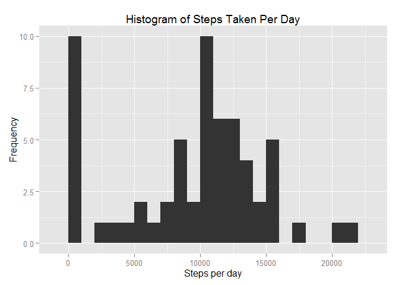
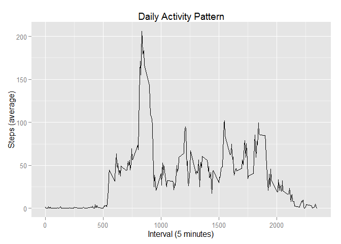
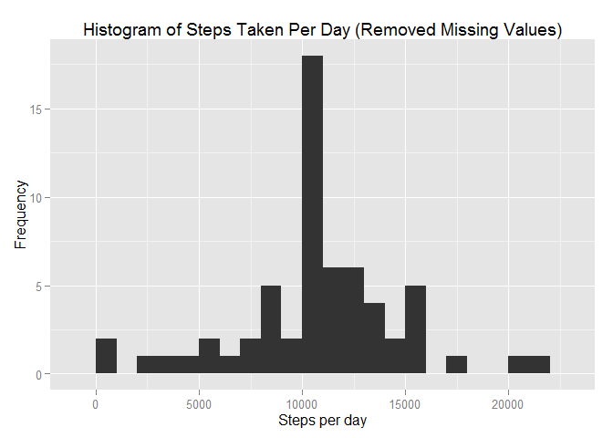
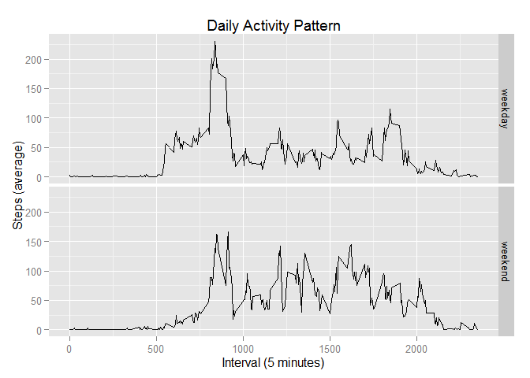

# Reproducible Research: Peer Assessment 1


## Loading and preprocessing the data

The first step of this report is loading and preprocessing the "activity" dataset. We load the dataset with the following R code.

```r
suppressMessages(library(dplyr))

data <- read.csv("activity.csv")
str(data)
```

```
## 'data.frame':	17568 obs. of  3 variables:
##  $ steps   : int  NA NA NA NA NA NA NA NA NA NA ...
##  $ date    : Factor w/ 61 levels "2012-10-01","2012-10-02",..: 1 1 1 1 1 1 1 1 1 1 ...
##  $ interval: int  0 5 10 15 20 25 30 35 40 45 ...
```

Note that the steps columns have the correct "int" type and the date column is a factor by default. No pre-processing is needed.

## What is mean total number of steps taken per day?

In this section we analyze how many steps are taken a day. We again use the 'dplyr' package. Here is a histrogram of the total number of steps taken each day.

```r
suppressMessages(library(ggplot2))
dategroups <- group_by(data, date)
datesteps <- summarize(dategroups, steps = sum(steps, na.rm=TRUE))
qplot(steps, data = datesteps, main = "Steps Taken Per Day",
     xlab = "Steps per day", ylab = "Frequency", binwidth=1000)
```

 

The mean value of the steps taken per day is

```r
mean(datesteps$steps)
```

```
## [1] 9354.23
```
and the median is

```r
median(datesteps$steps)
```

```
## [1] 10395
```

## What is the average daily activity pattern?


```r
intervalgroups <- group_by(data, interval)
intervalsteps <- summarize(intervalgroups, avgsteps = mean(steps, na.rm=TRUE))
qplot(interval, avgsteps, data = intervalsteps, geom="line",
      main = "Daily Activity Pattern", xlab = "Interval (5 minutes)",
      ylab = "Steps (average)")
```

 

## Imputing missing values

In this section we will analyze the missing values in the data and will fill in all of the missing values. First we calculate the total number of missing values in the data.


```r
length(which(is.na(data$steps)))
```

```
## [1] 2304
```

We will fill all the missing values in our data. Our strategy is to fill them with the mean value of that 5-minute interval averaged over all days. Note that we already computed and stored the required data in the previous section.


```r
data_NAremoved <- merge(data, intervalsteps, by.x="interval", by.y="interval")
data_NAremoved <- arrange(data_NAremoved, date, interval)
index_NA <- which(is.na(data_NAremoved$steps))
data_NAremoved$steps[index_NA] <- data_NAremoved$avgsteps[index_NA]
data_NAremoved <- data_NAremoved[c("steps", "date", "interval")]
```

Now let us make a histogram of the the total number of steps taken each day with the new data.


```r
dategroups <- group_by(data_NAremoved, date)
datesteps <- summarize(dategroups, steps = sum(steps))
qplot(steps, data = datesteps, main = "Steps Taken Per Day (Removed Missing Values)",
      xlab = "Steps per day", ylab = "Frequency", binwidth = 1000)
```

 

The new mean value of the steps taken per day is

```r
mean(datesteps$steps)
```

```
## [1] 10766.19
```
and the new median is

```r
median(datesteps$steps)
```

```
## [1] 10766.19
```

Note that both the mean and the median values are **greater** than the values computed in Section 1. This is expected since we have converted NAs into new values instead of ignoring them when computing the total.

## Are there differences in activity patterns between weekdays and weekends?

First we create a new factor variable indicating whether the given date is a weekday or a weekend.


```r
data_NAremoved <- mutate(data_NAremoved,
                         datetype = factor(
                           ((weekdays(as.POSIXlt(date)) == "Saturday") |
                              (weekdays(as.POSIXlt(date)) == "Sunday")),
                           labels = c("weekday", "weekend")))
datetypegroups <- group_by(data_NAremoved, interval, datetype)
datetypesteps <- summarize(datetypegroups, steps = mean(steps))
qplot(interval, steps, data = datetypesteps, geom = "line",
      main="Daily Activity Pattern", xlab="Interval (5 minutes)",
      ylab="Steps (average)", facets=datetype ~ .)
```

 


